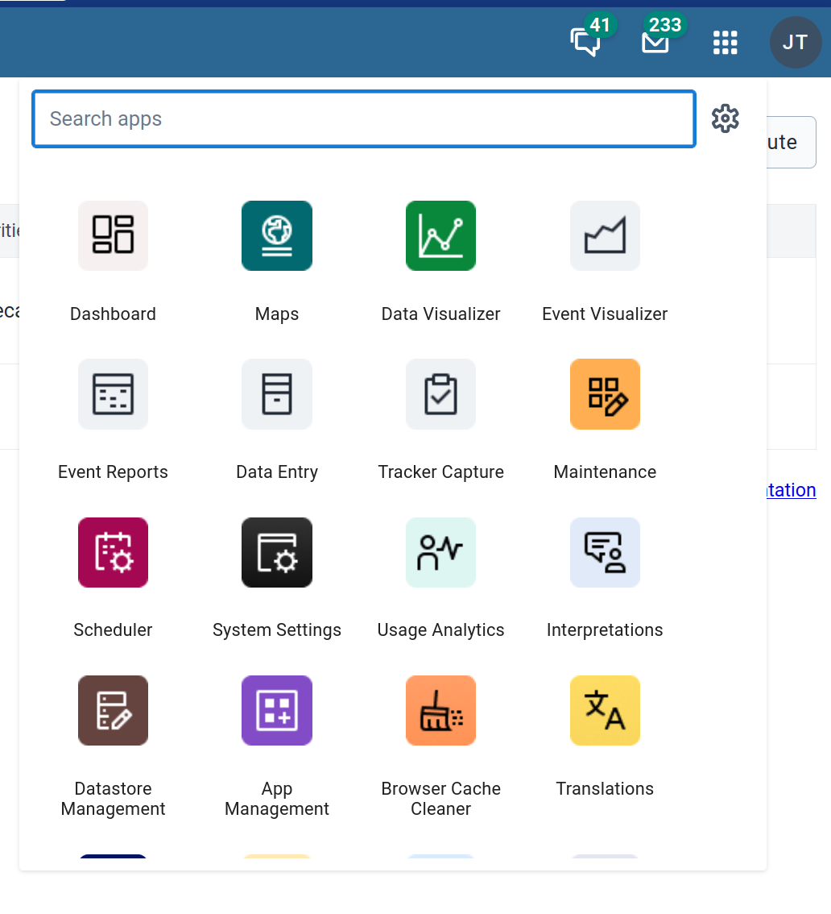
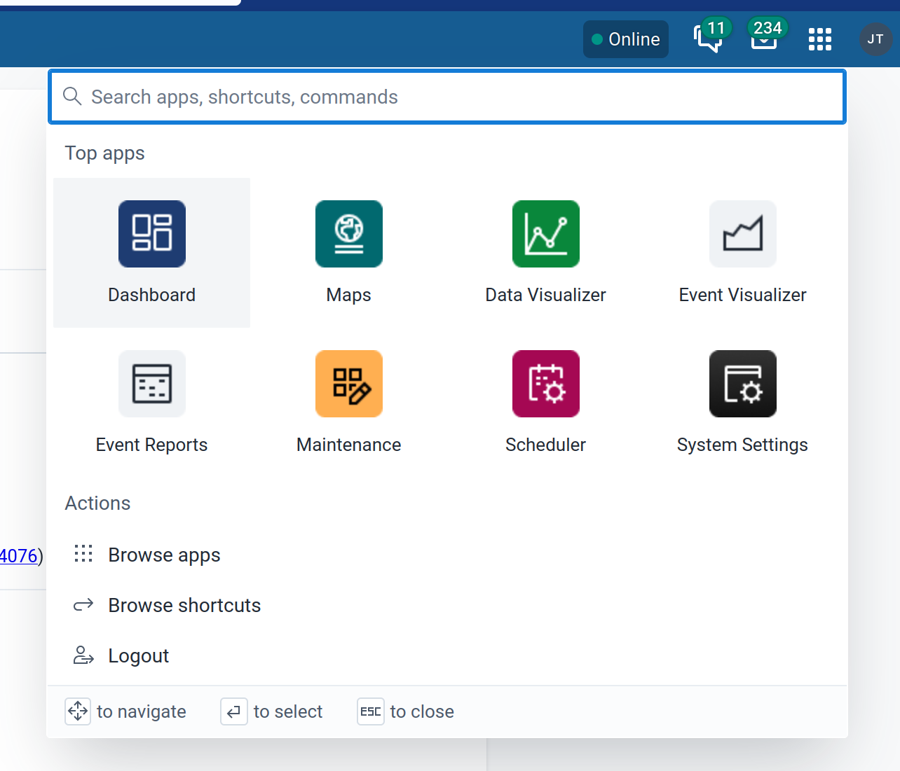
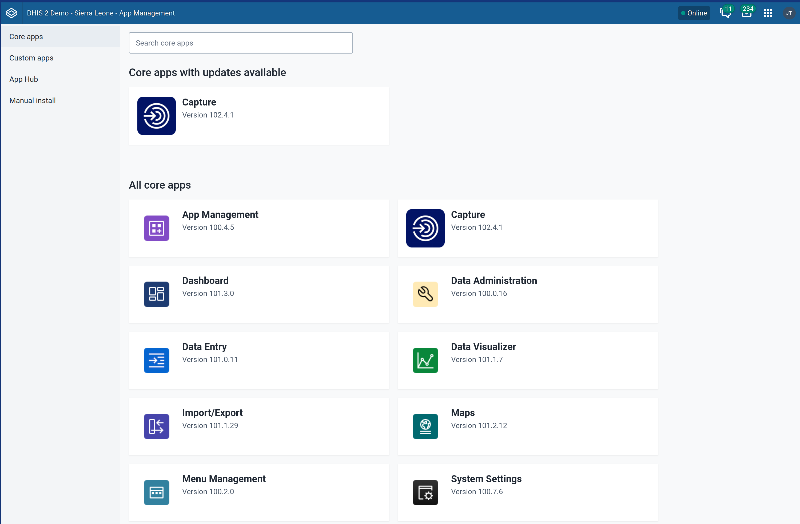
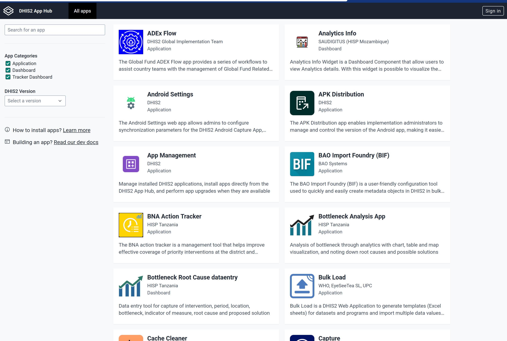
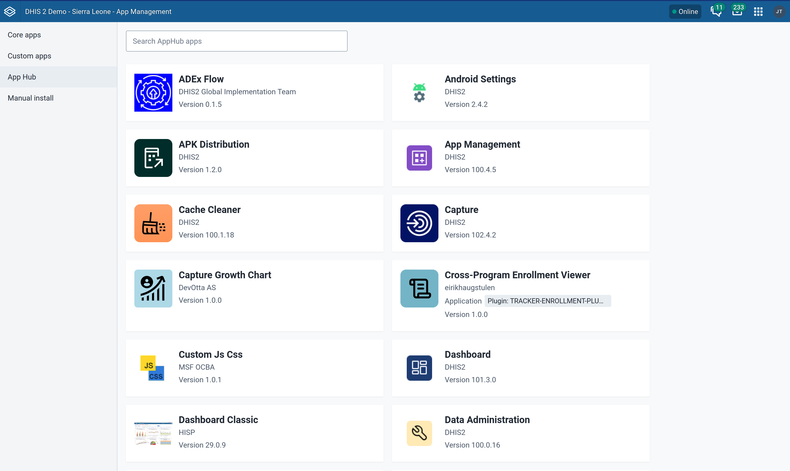
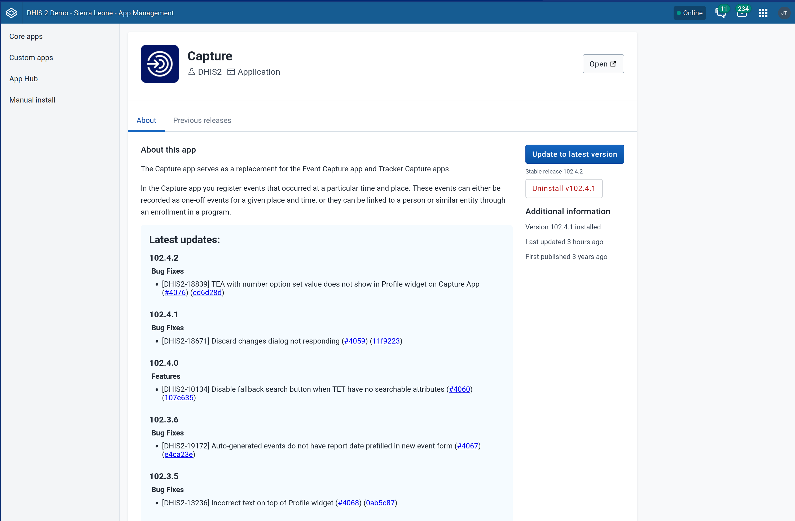
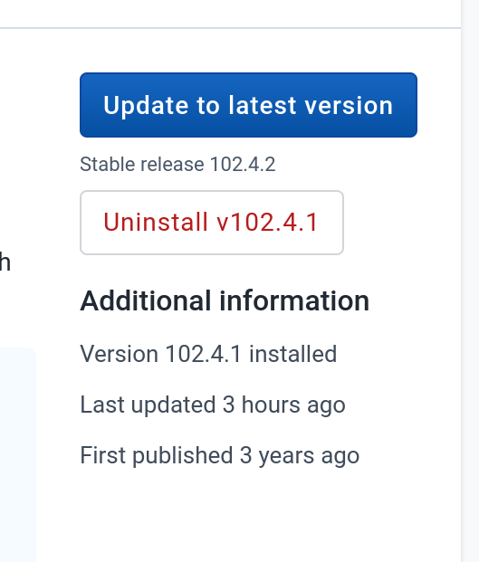
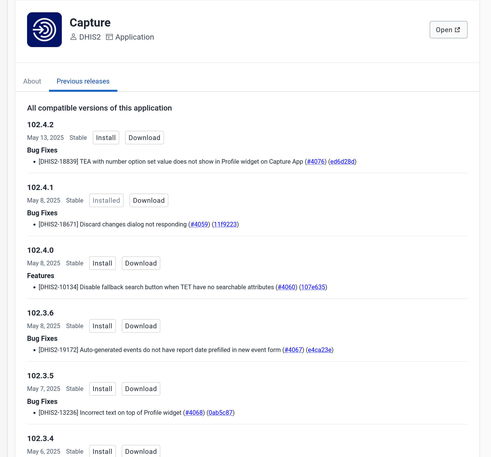

## Installing Apps into DHIS2 { #apps_installing_apps }

Applications are one of the main ways that DHIS2 can be extended. A DHIS2 installation comes bundled with around 30 _core_ apps.

These apps can be accessed from the search menu on the header bar (top image below) or the more powerful command palette since DHIS2 v42 (bottom image).

{ width=50% }

{ width=50% }

One of the core apps is the App Management app which is used to install, update, delete and maintain installed apps on an DHIS2 instance.

The App Management app has four sections:

### Core apps

These are the apps typically bundled with a DHIS2 installations. They provide core functionality for DHIS2 — for example, data entry (aggregate and tracker), maintenance, analytics, and visualisation — among many other use cases.

In the App Management core apps page, you can see the currently installed apps and their versions. Apps with updates available are highlighted at the top.

### Custom apps

This section displays apps that are installed manually from the _Manual Install_ section. Since these are manually installed, they might lack some information (such as their version, and whether there is an update).

### App Hub

Other than the DHIS2 applications provided by the core team, there is a thriving community of developers that builds and maintains apps for the platform. These can be accessed and viewed on the App Hub: [https://apps.dhis2.org](https://apps.dhis2.org).

The _App Hub_ section in the App Management app integrates with App Hub to seamlessly allow users to install and manage apps available in the App Hub.

### Manual Install

In this section, users can install apps manually by uploading a zip file containing a DHIS2-compliant app. The zip files can be obtained from a variety of sources (GitHub release pages, App Hub, directly from developers, etc.)

For information on developing such DHIS2 apps, you can refer to the developer documentation: [https://developers.dhis2.org/docs](https://developers.dhis2.org/docs).

## App details view

When you click on one of the apps in any section (core, custom or App Hub), you will be taken to the application details view.

The top part of the application view provides the basic information about the app:

1. The app name
1. The app developer - which links to the developers' page on App Hub
1. The application type: although the most common type of extensions are _web_ apps, there are also other types of extensions such as plugins (plugins for Capture app, Dashboard widgets and other custom plugins)
1. A link to open the app if it is installed

### About the App

The _About_ tab provides the app description provided by the developer, as well as a list of the latest updates to the app if they are provided by the developer.

#### Latest Updates

The _Latest Updates_ section provides information about what features or bug fixes were added in each version of the app. This allows administrators to make an informed decision on whether to upgrade an app to a specific version or not.

This section depends on the developers providing the information, either automatically through change logs, or manually by updating the App Hub page for the app. Both of these approaches are described in details in the developers documentation for developers and organisations who want to integrate change logs in their apps development process.

### Updating and uninstalling apps

On the right of the app page (in the About tab), there are also buttons that allow you to _Update to latest version_ if you are not on the latest version, as well as completely uninstalling the app if you wish to.

{ width=50% }

### Launching Apps { #apps_launching_apps }

You can open an installed app using the _Open_ button at the top of the app details page or by searching for it either in the app menu or Command Palette (available in DHIS2 version 42+).

### Previous Releases

The _Previous Releases_ tab provides an extended view of the _Latest Updates_ section. It lists all the versions of the app that are compatible with the instance's DHIS2 version.

Each version entry allows the user to install the specific version of the app, or download the zip file of the app - the downloaded file could then manually installed if you wish to, but it is better to use the install option so that the App Management app can keep track of the apps' history and alert you for future releases.

